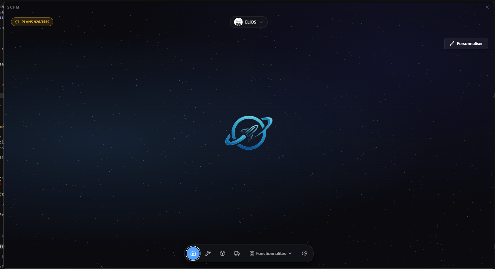
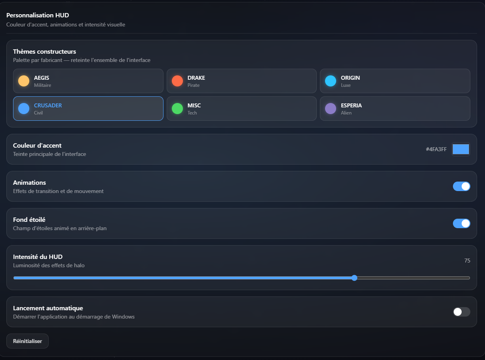

<p align="center">
  
</p>

<h1 align="center">SC Fleet Manager — V2</h1>

<p align="center">
  Gestionnaire de flotte <b>Star Citizen</b> pour le bureau (Windows). Il regroupe au même
  endroit ton hangar, tes outils de décision (comparateur, loadout, chaînes CCU, crafting)
  et tes outils de terrain (routes commerciales, GPS de trading, catalogue marchand, carte
  galactique) — le tout consultable hors-ligne depuis une base locale.
</p>

<p align="center">
  <a href="https://github.com/elios134/sc-fleet-manager-v2/releases/latest">
    
  </a>
  
  
</p>

<p align="center">
  
  
  
  
  
  
  
</p>

---

## Présentation

**SC Fleet Manager** est une application de bureau qui sert de poste de commandement pour un
joueur de Star Citizen. Tu connectes ton compte **RSI** : l'application importe ton hangar
(packs, vaisseaux, vaisseaux loués, niveau concierge) et l'enrichit avec des données de jeu
publiques (SC Wiki, UEX) pour transformer cette liste en outils utiles au quotidien — savoir
quel vaisseau acheter ou améliorer, où vendre sa cargaison au meilleur prix, comment naviguer
jusqu'au point de vente, ou quelles missions farmer.

Pensée pour un usage réel : **plusieurs comptes RSI**, interface **français / anglais**, thème
d'accent personnalisable, **mises à jour automatiques signées**, et surtout un fonctionnement
**hors-ligne** — une fois les données synchronisées, tout reste consultable sans connexion
depuis une base **SQLite** locale. Au premier lancement, une synchronisation guidée
(*onboarding*) enchaîne automatiquement les différentes sources.

<!-- DÉMO VIDÉO (demo-pages.mp4) : glisse le fichier dans l'éditeur du README sur
     github.com (ou une issue brouillon), copie l'URL https://github.com/user-attachments/assets/…
     générée, et colle-la ci-dessous SEULE sur sa propre ligne → GitHub l'affiche en lecteur.

https://github.com/user-attachments/assets/XXXXXXXX

-->

---

## Fonctionnalités

### Flotte & possessions

| Module | Description |
| --- | --- |
| **Tableau de bord** | Page d'accueil composée de widgets repositionnables en glisser-déposer : valeur/compteur de flotte, assurances à échéance, missions recommandées, suggestion CCU, locations qui expirent, top des routes rentables, et carte galactique embarquée. |
| **Ma flotte** | Hangar importé depuis RSI : packs, vaisseaux, valeurs, statut d'assurance (LTI), vaisseaux **loués avec compte à rebours** d'expiration, et ajout manuel. |
| **Objets & cosmétiques** | Objets du hangar RSI : skins, équipement FPS, composants et autres cosmétiques rattachés aux pledges. |
| **Suivi d'assurance** | Échéances LTI / durées limitées, tri par urgence pour ne rien laisser expirer. |

### Aide à la décision

| Module | Description |
| --- | --- |
| **Comparateur** | Comparaison de deux vaisseaux côte à côte (specs détaillées + graphe radar sur 6 axes : vitesse, puissance de feu, défense, portée, agilité, polyvalence). Puise dans la flotte **et** dans le catalogue. |
| **Configurateur (Loadout)** | Édition des points d'emport (armes, boucliers, propulsion, quantum drives…), profils sauvegardés et statistiques recalculées. |
| **CCU Chain** | Planificateur de chaînes d'upgrade CCU depuis le catalogue RSI : trouve l'enchaînement d'améliorations le moins cher pour atteindre un vaisseau cible. |
| **Crafting Hub** | Blueprints de craft (recettes, ingrédients, stats, modificateurs de qualité) et suivi des plans possédés. |
| **Mission Hub** | Catalogue des missions : recherche, filtres, récompenses, réputation, objectifs et favoris. |

### Commerce & navigation

| Module | Description |
| --- | --- |
| **Cargo & Routes** | Quatre outils dans une page : **planificateur de route** (meilleure route depuis un point de départ), **planificateur de boucle** (chaînes de routes rentables enchaînées), **GPS de trading** (navigation pas-à-pas depuis un lieu, avec **carte visuelle du trajet**), et **grille de soute** (plan de chargement SCU). Calculs de profit et de temps de trajet basés sur les Quantum Drives. |
| **Catalogue** | Catalogue marchand UEX géolocalisé : **items vendables in-game** (où acheter, à quel prix) et **marché des vaisseaux** (achat et location en aUEC, par point de vente). |
| **Carte galactique** | Starmap interactive (systèmes, corps célestes, points d'intérêt) construite à partir des données du **SC Wiki** — disponible pour tous, sans datamining ni jeu installé. |

> **Nouveautés 2.2.0** — GPS de trading avec carte visuelle du trajet, module Catalogue
> (items + marché des vaisseaux), et regroupement des synchronisations en boutons clairs
> dans les réglages.

### Réglages & synchronisations

- **Comptes RSI** — gestion multi-comptes (ajout, changement de compte actif, suppression), session isolée par compte.
- **Données** — synchronisations regroupées : un bouton **« Tout synchroniser »**, et trois groupes ordonnés — **Données SC Wiki** (vaisseaux, composants, missions, blueprints), **Cargo & Carte** (lieux puis carte galactique) et **Catalogue UEX** (prix, items, marché des vaisseaux). Le **catalogue CCU** (qui demande une connexion RSI) reste à part, et une section **« Sync avancée »** repliable permet de relancer chaque synchronisation individuellement.
- **Datamining** *(optionnel)* — extraction locale via StarBreaker depuis ton installation Star Citizen (`Data.p4k`), pour enrichir certaines données (noms, gisements miniers, stats de craft). Entièrement local, jamais requis pour utiliser l'application.
- **Apparence** — couleur d'accent appliquée en direct à toute l'interface, fond étoilé animé (activation et densité).
- **Système** — lancement au démarrage, langue FR/EN, vérification des mises à jour.

---

## Personnalisation du thème

Dans **Réglages → Apparence**, l'interface s'adapte en direct :

- **Couleur d'accent** — boutons, liens et surbrillances de toute l'application
- **Fond étoilé animé** — activation et densité des étoiles
- Réglages persistés, appliqués immédiatement sur toutes les pages

<p align="center">
  
</p>

---

## Sources de données

| Source | Usage |
| --- | --- |
| **RSI** (robertsspaceindustries.com) | Login + import du hangar (pledges, concierge), catalogue CCU |
| **SC Wiki API** (api.star-citizen.wiki) | Vaisseaux, composants, missions, blueprints, lieux et carte galactique |
| **UEX** (uexcorp.uk) + **Trade Tools** (sc-trade.tools) | Prix marchands, stocks, catalogue d'items et marché des vaisseaux, référentiel cargo |
| **StarBreaker** (datamining local, optionnel) | Données extraites de `Data.p4k` — 100 % sur ta machine |

Tout est stocké localement dans une base **SQLite** (`scfleet.db`, 22 migrations) ; en dehors
des API publiques ci-dessus, rien n'est envoyé à un tiers.

---

## Stack technique

- **Frontend** — React 19, TypeScript (strict), Vite 7, Tailwind CSS v4, React Router 7,
  i18next (FR/EN), Recharts, dnd-kit, lucide-react.
- **Backend** — Rust + **Tauri 2**, `tauri-plugin-sql` (SQLite), plugins `updater`,
  `autostart`, `notification`, `dialog`, `process`, `opener`.
- **Mise à jour** — installeur **NSIS** (Windows) + updater Tauri **signé** (clé minisign),
  `latest.json` publié sur les GitHub Releases.

---

## Développement

> Prérequis : [Node.js](https://nodejs.org) 20+, [Rust](https://rustup.rs) stable, et les
> [dépendances Tauri](https://tauri.app/start/prerequisites/) (WebView2 sous Windows).

```bash
git clone https://github.com/elios134/sc-fleet-manager-v2.git
cd sc-fleet-manager-v2
npm install
npm run tauri dev
```

Build d'un installeur Windows :

```bash
npm run tauri build -- --bundles nsis
# → src-tauri/target/release/bundle/nsis/
```

---

## Release & mises à jour

La publication est automatisée par **GitHub Actions** (`.github/workflows/release.yml`),
déclenchée au push d'un tag `vX.Y.Z` (qui doit correspondre à la `version` de
`src-tauri/tauri.conf.json`) :

1. build de l'installeur NSIS,
2. signature de l'artifact updater (secrets `TAURI_SIGNING_PRIVATE_KEY` / `…_PASSWORD`),
3. création de la **GitHub Release** avec `setup.exe`, `.sig` et `latest.json`.

L'application vérifie au démarrage (et depuis **Réglages → À propos**) la présence d'une
nouvelle version, télécharge l'installeur signé, vérifie la signature, puis se relance.

---

## Téléchargement

<p align="center">
  <a href="https://github.com/elios134/sc-fleet-manager-v2/releases/latest">
    
  </a>
</p>

> Windows peut afficher un avertissement **SmartScreen** (l'installeur n'est pas signé par un
> certificat éditeur). L'updater Tauri, lui, vérifie sa propre signature minisign.

---

<p align="center">
  <sub>Projet personnel — Star Citizen® est une marque de Cloud Imperium Games. Cette application
  n'est ni affiliée ni soutenue par CIG.</sub>
</p>
